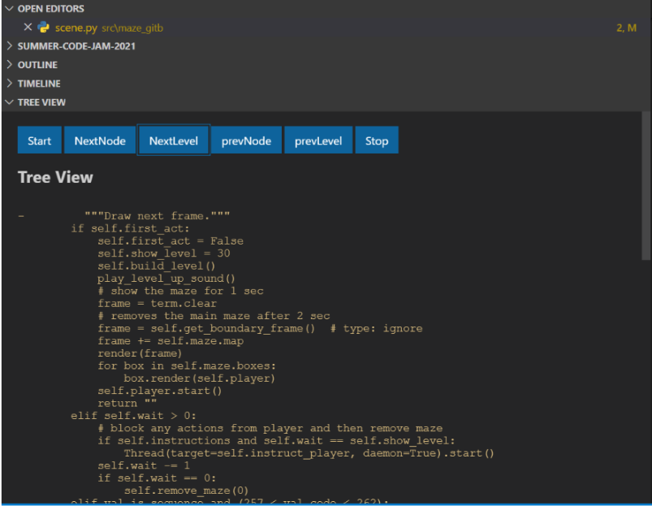

# Blind Debugger Extension

This extension of VS-code is made specifically for blind programmers to help them make the process of coding easy and stress-free.

To achieve this we have taken the job of being an eye-of-programmer. Our extension **Code Vision** is a easy-to-use extension which will parse a given folders and files, and create a tree using them which will have the folder structure and python file structure having classes and functions. User can navigate through the entire project using either arrow keys or GUI buttons. 




#### There are 6 buttons,where 4 are for traversal and one for starting and other for stopping.They can be operated by using keys(2-7) as well.

## Run The Sample

```bash

# Install sample dependencies
npm install

# Open sample in VS Code
code .

```

Once the sample is open inside VS Code you can run the extension by doing the following:

1. Press `F5` to open a new Extension Development Host window
2. Inside the host window, open the command palette (`Ctrl+Shift+P` or `Cmd+Shift+P` on Mac) and type `Explorer: Focus on Weather View`

## Features
- Identification on Syntax errors for each python file
- Code reading with different voice, for error lines in python file the speaker will read it in different voice, it will give the blind programmer a better idea of an error.
- Making our parser more interactive, optimised and bug-free (errors that were made due to difference between javascript and typescript files and some implementation errors).
- Adding deep file read functionality where code will be parsed on the root level, it will add a node containing the function’s definition/code to each function making the parsing and code reading process more effective.

- Key bindings.
> If we press
> - 1 → Check weather
> - 2 → Start parsing
> - 3 → Traverse to next node
> - 4 → Traverse to next level
> - 5 → Traverse to previous level
> - 6 → Traverse to previous node
> - 7 → Stop speaking


## Future Work:

Due to time constraints the approach we used was static in nature, it does everything in a static way, with some more time a dynamic debugging tool with similar type of UI can be developed.</br>
Same type of functionality can be added for other languages like C++, java, Javascript etc.

## Developer Side
For generation of directory based tree
```
tree -a ../codeVision -o ../codeVision/src/Parsing/treeviewcontent.txt
```
